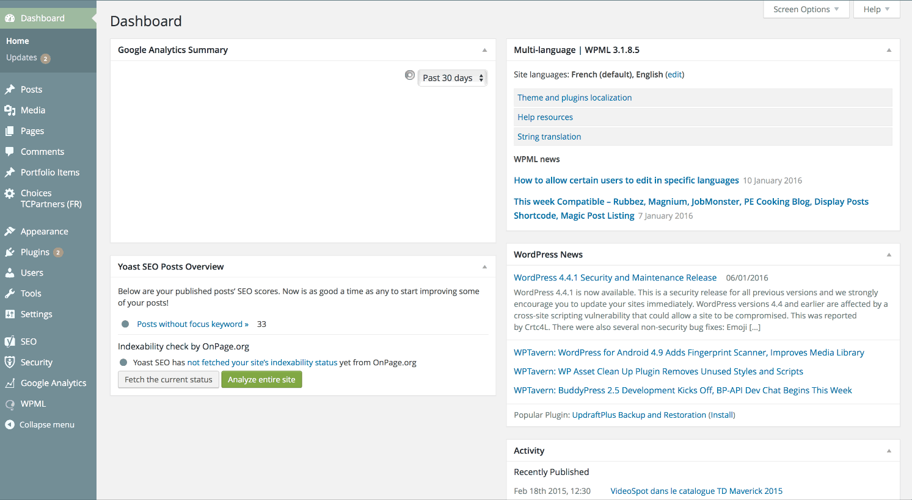

# VideoSpot App Publisher WordPress plugin

VideoSpot App Publisher is a WordPress plugin to publish your posts and pages as VideoSpot Apps. VideoSpot is a digital signage plate-form. You can create a free account at <http://join.videospot.com>.

As soon as you have configured the plugin, you will have a new button below the classic *Publish* one on each page and post edition page in your dashboard.

The plugin is hosted on the WordPress repository at this address: <https://wordpress.org/plugins/videospot-app-publisher>

Don't hesitate to ask us new features or report bugs on [the plugin page](https://wordpress.org/support/plugin/videospot-app-publisher/) !

## Installation, configuration and usage



## Hint to publish on WP repo

When using several SVN accounts on your computer, change the username when commiting :

```
svn ci --username TCPartners -m 'Version x.x.x'
```
